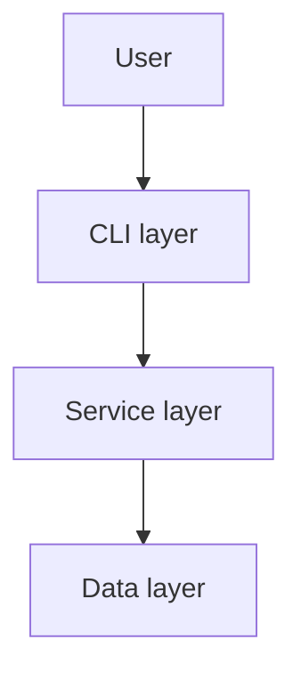
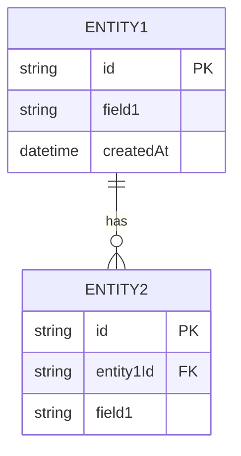
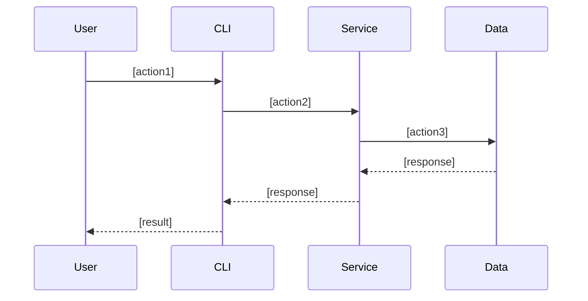
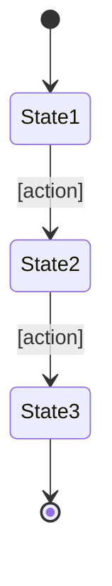

# Functional Design Document

## System Architecture Diagram



## Technology Stack

| Category | Technology | Reason for selection |
|------|------|----------|
| Language | [language name] | [reason] |
| Framework | [name] | [reason] |
| Database | [name] | [reason] |
| Tool | [name] | [reason] |

## Data Model Definition

### Entity: [entity name]

```typescript
interface [EntityName] {
  id: string;              // UUID
  [field1]: [type];        // [description]
  [field2]: [type];        // [description]
  createdAt: Date;         // Creation timestamp
  updatedAt: Date;         // Update timestamp
}
```

**Constraints**:
- [constraint 1]
- [constraint 2]

### ER Diagram



## Component Design

### [Component 1]

**Responsibilities**:
- [responsibility 1]
- [responsibility 2]

**Interface**:
```typescript
class [ComponentName] {
  [method1]([params]): [return];
  [method2]([params]): [return];
}
```

**Dependencies**:
- [dependency 1]
- [dependency 2]

## Use Case Diagrams

### [Use case 1]



**Flow description**:
1. [step 1]
2. [step 2]
3. [step 3]

## Screen Transition Diagram (Where Applicable)



## API Design (Where Applicable)

### [Endpoint 1]

```
POST /api/[resource]
```

**Request**:
```json
{
  "[field]": "[value]"
}
```

**Response**:
```json
{
  "id": "uuid",
  "[field]": "[value]"
}
```

**Error responses**:
- 400 Bad Request: [condition]
- 404 Not Found: [condition]
- 500 Internal Server Error: [condition]

## Algorithm Design (Where Applicable)

### [Algorithm name]

**Purpose**: [description]

**Calculation logic**:

#### Step 1: [step name]
- [detailed description]
- Formula: `[formula]`
- Score range: 0-100 points

#### Step 2: [step name]
- [detailed description]
- Formula: `[formula]`
- Score range: 0-100 points

#### Step 3: Calculate the total score
- Weighted average: `total score = (step 1 × weight 1) + (step 2 × weight 2)`
- Weight distribution:
  - Step 1: [%]
  - Step 2: [%]

#### Step 4: Classification
- [class 1]: score >= [threshold]
- [class 2]: [threshold] <= score < [threshold]
- [class 3]: score < [threshold]

**Implementation example**:
```typescript
function [algorithmName]([params]): [return] {
  // Step 1
  const score1 = [calculation];

  // Step 2
  const score2 = [calculation];

  // Total score
  const totalScore = (score1 * weight1) + (score2 * weight2);

  // Classification
  if (totalScore >= threshold1) return '[class 1]';
  if (totalScore >= threshold2) return '[class 2]';
  return '[class 3]';
}
```

## UI Design (Where Applicable)

### Table Display

**Display items**:
| Item | Description | Format |
|------|------|-------------|
| [item 1] | [description] | [format] |
| [item 2] | [description] | [format] |

### Color Coding

**Color usage**:
- [color 1]: [purpose] (e.g., green = completed)
- [color 2]: [purpose] (e.g., yellow = in progress)
- [color 3]: [purpose] (e.g., red = not started)

### Interactive Mode (Where Applicable)

**Operation flow**:
1. [operation 1]
2. [operation 2]
3. [operation 3]

## File Structure (Where Applicable)

**Data storage format**:
```
[directory]/
├── [file1].json    # [description]
└── [file2].json    # [description]
```

**Example file contents**:
```json
{
  "[field]": "[value]"
}
```

## Performance Optimization

- [optimization 1]: [description]
- [optimization 2]: [description]

## Security Considerations

- [consideration 1]: [countermeasure]
- [consideration 2]: [countermeasure]

## Error Handling

### Error Classification

| Error type | Handling | Message shown to the user |
|-----------|------|-----------------|
| [type 1] | [handling] | [message] |
| [type 2] | [handling] | [message] |

## Test Strategy

### Unit Tests
- [target 1]
- [target 2]

### Integration Tests
- [scenario 1]
- [scenario 2]

### E2E Tests
- [scenario 1]
- [scenario 2]
