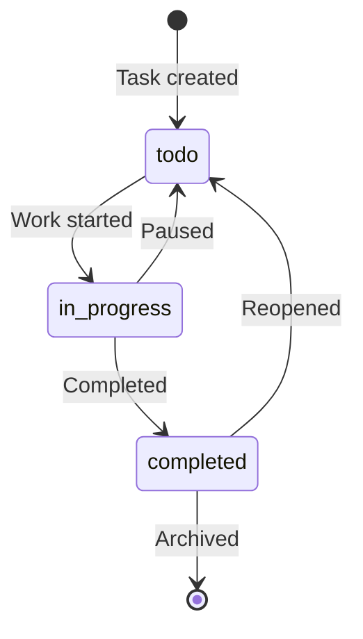

# Glossary Creation Guide

## Basic Principles

### 1. Clear and Consistent Definitions

Term definitions must eliminate ambiguity so that every reader reaches the same understanding.

**Bad example**:
```markdown
## Task
Something the user needs to do
```

**Good example**:
```markdown
## Task

**Definition**: A unit of work the user must complete. Has a title, description, due date,
and status (todo / in progress / completed).

**Related terms**: Subtask, Task Group

**Usage examples**:
- "Add a task": register a new task in the system
- "Complete a task": change the task's status to completed

**Data model**: `src/types/Task.ts`
```

### 2. Include Concrete Examples

Provide concrete usage examples, not just abstract definitions.

**Example**:
```markdown
## Priority

**Definition**: A 3-level indicator showing a task's importance and urgency

**Value definitions**:
- `high`: urgent and important. Requires immediate attention
- `medium`: important but not urgent. Address according to plan
- `low`: low importance and low urgency. Address when time allows

**Decision criteria**:
- high: due within 24 hours, or blocking other tasks
- medium: due within 1 week
- low: due more than 1 week out, or no due date

**Usage example**:
```typescript
const task: Task = {
  title: 'Fix security vulnerability',
  priority: 'high', // Requires urgent attention
};
```
```

### 3. Link Related Terms

Make the relationships between terms explicit.

**Example**:
```markdown
## Task

**Definition**: [definition]

**Related terms**:
- [Subtask](#subtask): a finer-grained breakdown of a task
- [Task Group](#task-group): a collection of multiple tasks
- [Status](#task-status): a task's progress state

**Parent-child relationships**:
- Parent: Task Group
- Children: Subtasks
```

## How to Categorize Terms

### Defining Domain Terms

**Scope**: project-specific business concepts

**Items to define**:
```markdown
## [Term]

**Definition**: [concise definition in 1-2 sentences]

**Description**: [detailed description, background, constraints]

**Related terms**: [other related terms]

**Usage examples**: [concrete usage scenarios]

**Data model**: [relevant file path]

**English notation**: [English term] (if the project has global reach)
```

**Example**:
```markdown
## Steering File

**Definition**: A temporary document created for short-term task management

**Description**:
Steering files are placed in the `.steering/[YYYYMMDD]-[task-name]/` directory
and are deleted 1-2 weeks after task completion. They contain the task's
specification, implementation notes, review records, and so on.

**Related terms**:
- [Persistent documents](#persistent-documents): documents kept long-term
- [Task mode](#task-mode): the development mode that uses steering files

**Usage examples**:
- "Create a steering file for the feature addition"
- "After the task is complete, delete or archive the steering file"

**Directory structure**:
```
.steering/
└── 20250101-add-priority-feature/
    ├── requirements.md      # Requirements for this piece of work
    ├── design.md            # Design of the changes
    └── tasklist.md          # Task list
```

**English notation**: Steering File
```

### Defining Technical Terms

**Scope**: technologies, frameworks, and tools in use

**Items to define**:
```markdown
## [Technology name]

**Definition**: [concise description of the technology]

**Official site**: [URL]

**Usage in this project**: [how it is used]

**Version**: [version in use]

**Reason for selection**: [why this technology was chosen]

**Alternative technologies**: [other options considered]

**Related documents**: [links to internal documents]

**Configuration file**: [path to the configuration file]
```

**Example**:
```markdown
## TypeScript

**Definition**: A programming language that adds static typing to JavaScript

**Official site**: https://www.typescriptlang.org/

**Usage in this project**:
All source code is written in TypeScript to ensure type safety.

**Version**: 5.3.x

**Reason for selection**:
- Better maintainability in large-scale development
- Improved development efficiency via editor completion
- Error detection at compile time

**Alternative technologies**:
- JavaScript ESM: does not provide the benefits of type checking
- Flow: inferior to TypeScript in ecosystem maturity

**Related documents**:
- [Architecture design document](./architecture.md#technology-stack)
- [Development guidelines](./development-guidelines.md#typescript-conventions)

**Configuration file**: `tsconfig.json`
```

### Defining Abbreviations and Acronyms

**Principles**:
- State the full name
- On first appearance, give both the abbreviation and the full name
- Avoid project-specific abbreviations (use only widely known ones)

**Example**:
```markdown
## CLI

**Full name**: Command Line Interface

**Meaning**: An interface operated from the command line

**Usage in this project**:
Used as the main interface of the Devtask tool. Users operate on tasks
with commands like `devtask add "task"`.

**Implementation**: `src/cli/` directory

**Alternative interfaces**: a GUI version is under consideration as a future extension

## TDD

**Full name**: Test-Driven Development

**Meaning**: A development methodology where tests are written before implementation

**Application in this project**:
TDD is adopted for all new feature development.

**Procedure**:
1. Write a test
2. Run the test → confirm it fails
3. Write the implementation
4. Run the test → confirm it passes
5. Refactor

**Reference**: [Development guidelines](./development-guidelines.md#TDD)
```

### Defining Architecture Terms

**Scope**: concepts related to system design and patterns

**Items to define**:
```markdown
## [Concept]

**Definition**: [description of the architectural concept]

**Application in this project**: [concrete implementation approach]

**Advantages**: [reasons for adoption]

**Disadvantages**: [constraints and trade-offs]

**Related components**: [related components]

**Diagram**: [structure diagram]

**References**: [reference materials or URLs]
```

**Example**:
```markdown
## Layered Architecture

**Definition**: A design pattern that divides a system into multiple layers by role,
with one-directional dependencies from upper layers to lower layers

**Application in this project**:
A 3-layer architecture is adopted:

```
UI layer (cli/)
    ↓
Service layer (services/)
    ↓
Data layer (repositories/)
```

**Responsibilities of each layer**:
- UI layer: accepts user input and displays results
- Service layer: implements business logic
- Data layer: data persistence and retrieval

**Advantages**:
- Better maintainability through separation of concerns
- Easy to test (each layer can be tested independently)
- Limited blast radius for changes

**Disadvantages**:
- May be over-engineering for small projects
- Overhead from data transformation between layers

**Dependency rules**:
- ✅ UI layer → service layer
- ✅ Service layer → data layer
- ❌ Data layer → service layer
- ❌ Data layer → UI layer

**Implementation location**: reflected in the structure of the `src/` directory

**References**:
- [Architecture design document](./architecture.md)
- [Repository structure document](./repository-structure.md)
```

## Defining State Transitions

**Scope**: entity statuses and states

**How to define**:

1. **Enumerate in table form**
2. **State the transition conditions**
3. **Visualize with a Mermaid diagram**

**Example**:
```markdown
## Task Status

**Definition**: An enum representing a task's progress state

**Possible values**:

| Status | Meaning | Transition condition | Next state |
|----------|------|---------|---------|
| `todo` | Not started | Initial state at task creation | `in_progress` |
| `in_progress` | In progress | User starts the task | `completed`, `todo` |
| `completed` | Completed | User completes the task | `todo` (can be reopened) |

**State transition diagram**:


**Implementation**:
```typescript
// src/types/Task.ts
export type TaskStatus = 'todo' | 'in_progress' | 'completed';

// Validate state transitions
function canTransition(
  from: TaskStatus,
  to: TaskStatus
): boolean {
  const validTransitions: Record<TaskStatus, TaskStatus[]> = {
    todo: ['in_progress'],
    in_progress: ['completed', 'todo'],
    completed: ['todo'],
  };
  return validTransitions[from].includes(to);
}
```

**Business rules**:
- Direct transition from `todo` to `completed` is prohibited
- Completed tasks can be reopened
- Archived tasks cannot be modified
```

## Defining Errors and Exceptions

**Scope**: error classes defined in the system

**Items to define**:
```markdown
## [Error name]

**Class name**: `[ErrorClassName]`

**Extends**: `Error` or `[ParentError]`

**Occurrence conditions**: [when it occurs]

**Error message format**: [format of the message]

**How to handle**:
- User: [what the user should do]
- Developer: [what the developer should do]

**Error code**: [if applicable]

**Log level**: [ERROR, WARN, INFO]

**Implementation location**: [file path]

**Usage example**: [code example]
```

**Example**:
```markdown
## Validation Error

**Class name**: `ValidationError`

**Extends**: `Error`

**Occurrence conditions**:
Occurs when user input violates business rules.

**Error message format**:
```
[field name]: [error description]
```

**How to handle**:
- User: correct the input according to the error message
- Developer: verify that the validation logic is correct

**Error code**: `VAL-XXX` (XXX is a 3-digit number)

**Log level**: WARN (because the error is caused by the user)

**Implementation location**: `src/errors/ValidationError.ts`

**Usage example**:
```typescript
// Throwing the error
if (title.length === 0) {
  throw new ValidationError(
    'Title is required',
    'title',
    title
  );
}

// Handling the error
try {
  await taskService.create(data);
} catch (error) {
  if (error instanceof ValidationError) {
    console.error(`Input error: ${error.message}`);
    console.error(`Field: ${error.field}`);
  }
}
```

**Related validations**:
- Title: 1-200 characters
- Due date: current time or later
- Priority: one of high, medium, low
```

## Maintaining and Updating Terms

### When to Add Terms

**Add when**:
- A new concept has been introduced
- A team member asked about the term
- The term appears 3 or more times in documents
- An external service or API has been integrated

**No need to add when**:
- General programming terms (variable, function, etc.)
- One-off temporary terms used only once

### Update Workflow

1. **Add or change the term**
   - Add it to the appropriate category
   - Fill in all definition items
   - Link related terms

2. **Review**
   - Share with team members
   - Verify the definition is appropriate

3. **Record the change history**
   - Update the glossary's change history table
   - Note the change in the commit message

4. **Check the impact**
   - Search for places where the term is used
   - Update documents as needed

### Managing the Index

**Organize alphabetically**:

```markdown
## Index

### A
- [Archive](#archive) - process term

### C
- [CLI](#CLI) - abbreviation
- [Coverage](#coverage) - technical term

### E
- [Error handling](#error-handling) - technical term

### S
- [Status](#task-status) - data model term
- [Steering File](#steering-file) - domain term

### T
- [Task](#task) - domain term
- [TDD](#TDD) - abbreviation
- [TypeScript](#TypeScript) - technical term
```

## Checklist

- [ ] Every term is clearly defined
- [ ] Concrete examples are included
- [ ] Related terms are linked
- [ ] Categories are appropriately assigned
- [ ] Technical terms include version information
- [ ] Abbreviations include their full names
- [ ] State transitions are diagrammed
- [ ] Errors include handling guidance
- [ ] The index is organized
- [ ] The change history is recorded
