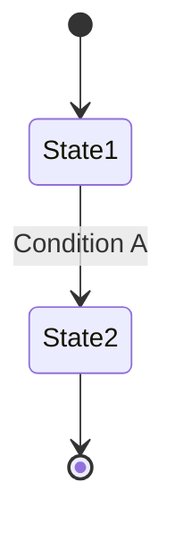

# Project Glossary

## Overview

This document manages the definitions of terms used within the project.

**Last updated**: [YYYY-MM-DD]

## Domain Terms

Terms related to project-specific business concepts and features.

### [Term 1]

**Definition**: [clear definition]

**Description**: [detailed description]

**Related terms**: [other related terms]

**Usage examples**:
- [example 1]
- [example 2]

**English notation**: [English Term]

### [Term 2]

**Definition**: [clear definition]

**Description**: [detailed description]

**Related terms**: [other related terms]

**Usage examples**:
- [example 1]
- [example 2]

## Technical Terms

Terms related to the technologies, frameworks, and tools used in the project.

### [Technology 1]

**Definition**: [description of the technology]

**Official site**: [URL]

**Usage in this project**: [how it is used]

**Version**: [version in use]

**Related documents**: [links to internal documents]

### [Technology 2]

**Definition**: [description of the technology]

**Official site**: [URL]

**Usage in this project**: [how it is used]

**Version**: [version in use]

## Abbreviations / Acronyms

### [Abbreviation 1]

**Full name**: [Full Name]

**Meaning**: [description]

**Usage in this project**: [where it is used]

### [Abbreviation 2]

**Full name**: [Full Name]

**Meaning**: [description]

**Usage in this project**: [where it is used]

## Architecture Terms

Terms related to system design and architecture.

### [Concept 1]

**Definition**: [description of the architectural concept]

**Application in this project**: [how it is implemented]

**Related components**: [names of related components]

**Diagram**:
```
[ASCII diagram or Mermaid diagram]
```

### [Concept 2]

**Definition**: [description of the architectural concept]

**Application in this project**: [how it is implemented]

## Statuses / States

Definitions of the various statuses used within the system.

### [Status type 1]

| Status | Meaning | Transition condition | Next state |
|----------|------|---------|---------|
| [state 1] | [description] | [condition] | [next state] |
| [state 2] | [description] | [condition] | [next state] |

**State transition diagram**:


## Data Model Terms

Terms related to the database and data structures.

### [Entity 1]

**Definition**: [description of the entity]

**Key fields**:
- `field1`: [description]
- `field2`: [description]

**Related entities**: [related entities]

**Constraints**: [unique constraints, foreign key constraints, etc.]

## Errors / Exceptions

Errors and exceptions defined in the system.

### [Error type 1]

**Class name**: `[ErrorClassName]`

**Occurrence conditions**: [when it occurs]

**How to handle**: [how the user/developer should respond]

**Error code**: [if applicable]

**Example**:
```typescript
throw new [ErrorClassName]('[message]');
```

## Calculations / Algorithms (Where Applicable)

Terms related to specific calculation methods and algorithms.

### [Calculation method 1]

**Definition**: [description of the calculation method]

**Formula**:
```
[formula]
```

**Implementation location**: `src/[path]/[file].ts`

**Example**:
```
Input: [example]
Output: [result]
```
