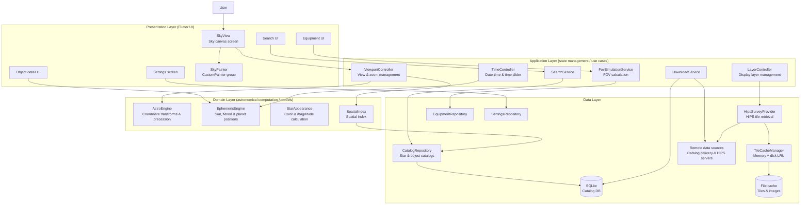
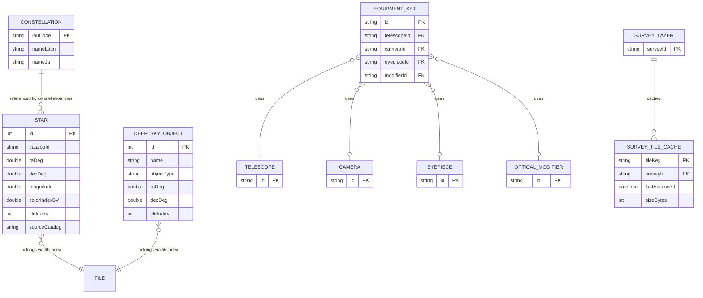
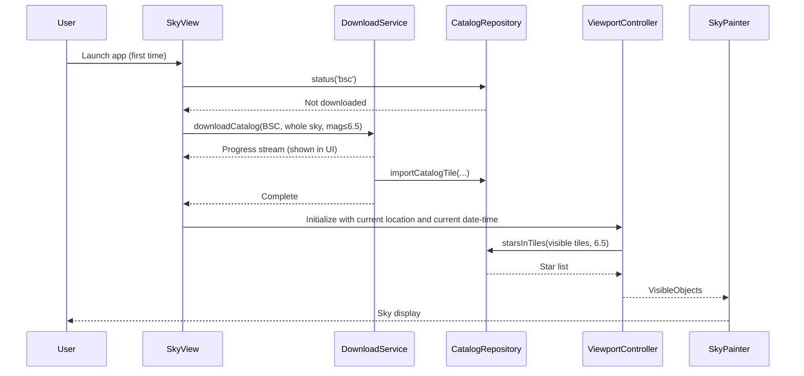
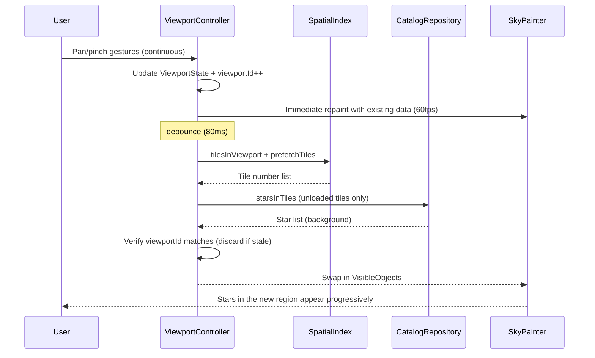
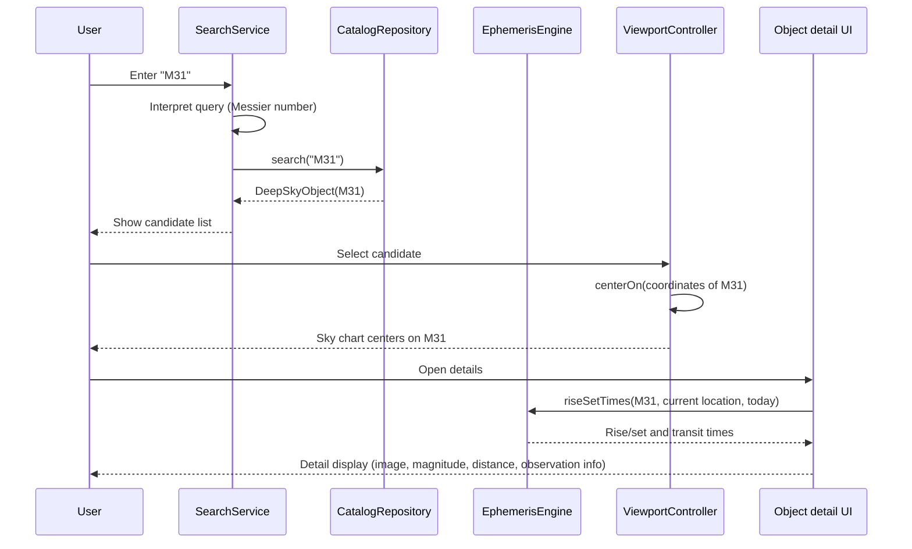
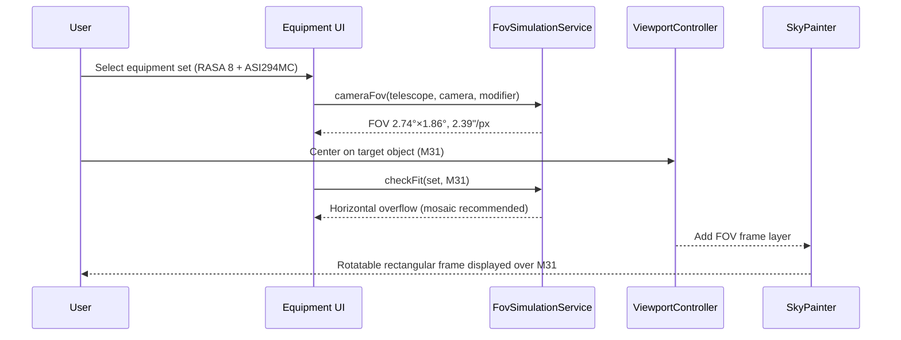
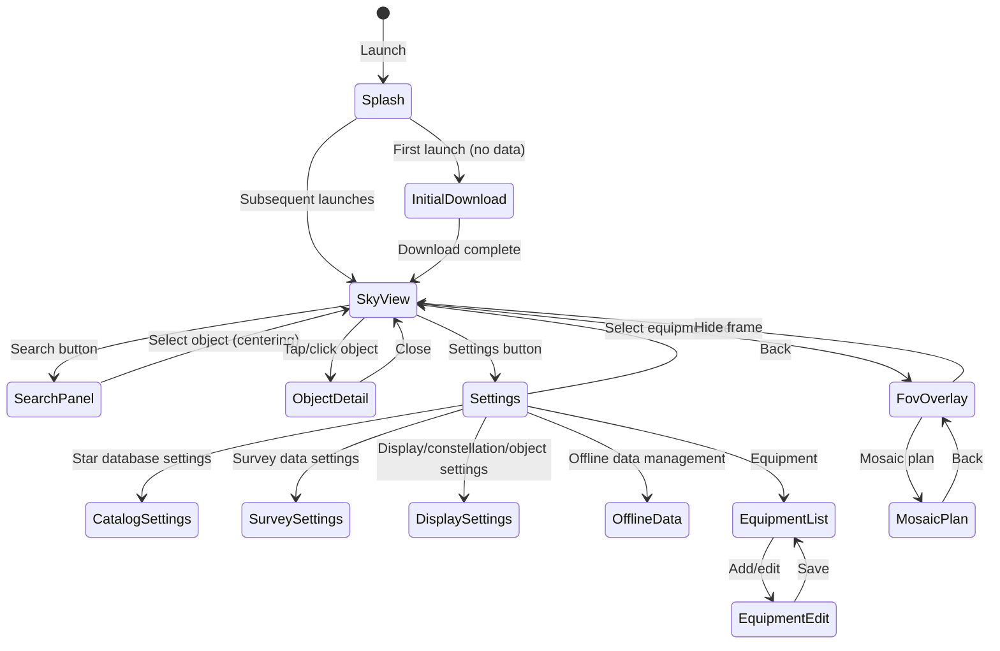

# Functional Design Document

This document defines how the requirements (F1–F13) defined in `docs/product-requirements.md` are realized technically.

## System Architecture Diagram



## Technology Stack

| Category | Technology | Rationale |
|------|------|----------|
| Framework | Flutter (Dart 3.x) | Deploys to Windows / macOS / Linux / iOS / Android from a single codebase (mandatory PRD requirement) |
| State management | Riverpod | Compile-time-safe DI, good fit with async state (AsyncValue), easy to test |
| Rendering | CustomPainter / Canvas (future: Fragment Shader) | Draw large numbers of stars in a single pass without creating widgets (F2 acceptance criterion). Glow effects can be extended via shaders |
| Local DB | SQLite (drift) | Per-tile queries against a spatially indexed star catalog, type-safe Dart query generation |
| HTTP | dio | Support for download progress, cancellation, and retry (F3 requirement) |
| Cache | Memory LRU + file cache (in-house implementation) | Off-the-shelf packages fall short of per-tile LRU management and capacity limits (F2/F11 requirements) |
| Geolocation | geolocator | GPS acquisition with permission fallback on all supported platforms |
| Settings persistence | shared_preferences + drift | Lightweight settings in prefs; structured data such as equipment profiles in the DB |
| Astronomical computation | In-house implementation (AstroEngine / EphemerisEngine) | Coordinate transforms and planetary position calculation (simplified VSOP87, etc.) are the core of the app, so external dependencies are avoided |

## Data Model Definitions

### Entity: Star

```dart
class Star {
  final int id;                  // Sequential number within the catalog
  final String? name;            // Proper name (e.g. Sirius). Mostly null
  final String catalogId;        // Catalog reference ID (HR number, TYC number, etc.)
  final double raDeg;            // RA J2000 [deg] 0-360
  final double decDeg;           // Dec J2000 [deg] -90 to +90
  final double magnitude;        // Apparent magnitude
  final double? colorIndexBV;    // B-V color index (used for color calculation)
  final String? spectralType;    // Spectral type (fallback for color)
  final double? properMotionRa;  // Proper motion RA [mas/yr]
  final double? properMotionDec; // Proper motion Dec [mas/yr]
  final double? parallax;        // Annual parallax [mas]
  final String? constellation;   // Constellation membership (IAU abbreviation: Ori, etc.)
  final String sourceCatalog;    // 'bsc' | 'tycho2' | 'gaia_dr3'
  final int tileIndex;           // Tile number in the spatial index
}
```

**Constraints**:
- `raDeg` is normalized to [0, 360) and `decDeg` to [-90, +90] before saving
- `tileIndex` is precomputed at import time and indexed in the DB
- Since range queries by magnitude and tile are the primary queries, a composite index `(tileIndex, magnitude)` is maintained

### Entity: DeepSkyObject (deep-sky object — non-stellar object outside the solar system)

```dart
class DeepSkyObject {
  final int id;
  final String name;                   // Primary name (e.g. Andromeda Galaxy)
  final List<String> alternativeNames; // Aliases and names in other languages
  final ObjectType objectType;         // nebula | galaxy | cluster | ...
  final String? messierNumber;         // 'M31' format
  final String? ngcIcNumber;           // 'NGC 224' / 'IC 434' format
  final double raDeg;
  final double decDeg;
  final double? magnitude;
  final double? angularSizeMajorDeg;   // Apparent diameter (major axis) [deg]
  final double? angularSizeMinorDeg;   // Apparent diameter (minor axis) [deg]
  final double? distanceLy;            // Distance [light-years]
  final String? constellation;
  final String? description;           // Description text (Japanese/English)
  final String? thumbnailAsset;        // Bundled/cached image path
  final int tileIndex;
}

enum ObjectType { nebula, galaxy, openCluster, globularCluster, planetaryNebula, supernovaRemnant, other }
```

### Entity: SolarSystemBody (solar system body)

```dart
class SolarSystemBody {
  final SolarBodyId bodyId;     // sun | moon | mercury ... neptune
  final String textureAsset;    // Texture for display
  // Positions are not stored; EphemerisEngine computes them from the date-time on demand
}
```

### Entity: ConstellationData (constellation)

```dart
class ConstellationData {
  final String iauCode;             // 'Ori' (primary key)
  final String nameLatin;           // 'Orion'
  final String nameJa;              // 'オリオン座'
  final String nameEn;              // 'Orion'
  final List<StarPair> lines;       // Constellation lines (list of star ID pairs)
  final List<SkyPoint> boundary;    // Constellation boundary (sequence of RA/Dec vertices)
  final String? artworkAsset;       // Constellation artwork image (P1)
  final SkyPoint labelAnchor;       // Position for displaying the constellation name
}
```

### Entity: SurveyLayer (survey layer)

```dart
class SurveyLayer {
  final String surveyId;        // e.g. 'dss2_color'
  final String name;
  final String hipsBaseUrl;     // HiPS base URL
  final String tileFormat;      // 'jpg' | 'png'
  final int minOrder;           // Minimum HiPS order
  final int maxOrder;           // Maximum HiPS order
  final String attribution;     // Attribution text
  final bool enabled;           // Display ON/OFF
  final double opacity;         // Opacity 0.0-1.0
  final int cacheLimitMb;       // Per-survey cache limit
}
```

**Built-in surveys (MVP)**: Four DSS2 layers are bundled as built-in definitions. All use HiPS provided by CDS.

| surveyId | Name | HiPS ID (CDS) | Wavelength band | Purpose |
|---|---|---|---|---|
| `dss2_color` | DSS Colored | `CDS/P/DSS2/color` | Visible (color composite) | Default layer. Standard for viewing and framing |
| `dss2_blue` | DSS Blue | `CDS/P/DSS2/blue` | Blue light (B) | Inspecting hot stars and reflection nebulae |
| `dss2_red` | DSS Red | `CDS/P/DSS2/red` | Red light (R) | Inspecting HII regions and emission nebulae |
| `dss2_nir` | DSS NIR | `CDS/P/DSS2/NIR` | Near-infrared (I/N) | Inspecting structure behind dark nebulae |

- Only one survey layer can be displayed at a time; layers are switched exclusively in the layer panel (each layer retains its own opacity)
- Adding 2MASS / WISE etc. (P1) is done purely by adding `SurveyLayer` records (architecture extensibility requirement)

### Entity: Equipment Profile

```dart
class Telescope {
  final String id;              // UUID
  final String name;
  final TelescopeType type;     // refractor | reflector | sct | rc | rasa | newtonian | other
  final double apertureMm;      // Aperture
  final double focalLengthMm;   // Focal length
  final String? note;
}

class CameraDevice {
  final String id;
  final String name;
  final double sensorWidthMm;
  final double sensorHeightMm;
  final double pixelSizeUm;
  final int resolutionX;
  final int resolutionY;
  final SensorType sensorType;  // cmos | ccd | dslr | mirrorless | planetary
  final bool isColor;
  final String? note;
}

class Eyepiece {
  final String id;
  final String name;
  final double focalLengthMm;
  final double apparentFovDeg;  // Apparent field of view
  final BarrelSize barrelSize;  // inch125 | inch2
  final String? note;
}

class OpticalModifier {
  final String id;
  final String name;
  final ModifierKind kind;      // barlow | reducer
  final double factor;          // Barlow: >1.0, reducer: <1.0
  final String? note;
}

class EquipmentSet {
  final String id;
  final String name;
  final String telescopeId;
  final String? cameraId;       // For camera FOV mode
  final String? eyepieceId;     // For eyepiece FOV mode
  final String? modifierId;     // Barlow/reducer (optional)
  final double rotationDeg;     // Frame rotation angle
  final int frameColor;         // Display color ARGB
  final String? note;
}
```

**Constraints**:
- `EquipmentSet` requires exactly one of `cameraId` or `eyepieceId` (both null is not allowed)
- Numeric inputs accept positive values only; validation errors are displayed

### Entity: ViewportState (display state — runtime model, not persisted)

```dart
class ViewportState {
  final double centerRaDeg;       // RA at screen center
  final double centerDecDeg;      // Dec at screen center
  final double fovDeg;            // Displayed field of view (the substance of the zoom level)
  final Size screenSize;          // Screen resolution
  final double limitingMagnitude; // Display limiting magnitude (derived from LOD)
  final Set<LayerId> enabledLayers;
  final DateTime observationTime; // Observation date-time (UTC)
  final GeoLocation location;     // Observing location
  final int viewportId;           // Generation ID for query cancellation
}
```

### ER Diagram



## Component Design

### AstroEngine (coordinate transformation)

**Responsibilities**:
- Conversion between equatorial coordinates (RA/Dec) and horizontal coordinates (Alt/Az) (computing sidereal time from observing location and date-time)
- Projection from horizontal coordinates to screen coordinates (stereographic projection)
- Inverse transform from screen coordinates to celestial coordinates (identifying the object at a tap position)

**Interface** (finalized form as of the M1 implementation; coordinate transformation and projection are separated):
```dart
/// Coordinate transformation (concrete class of pure computation; formulas need no mocking, so no abstraction)
class AstroEngine {
  double julianDate(DateTime utc);
  double gmstDeg(DateTime utc);
  double lstDeg(DateTime utc, double longitudeDeg);
  HorizontalCoord equatorialToHorizontal(SkyPoint radec, GeoLocation loc, DateTime utc);
  SkyPoint horizontalToEquatorial(HorizontalCoord hor, GeoLocation loc, DateTime utc);
}

/// Projection context for one frame (precomputes trigonometric values from ViewportState)
class ViewProjection {
  ViewProjection(ViewportState state);
  Offset? project(SkyPoint radec);              // Celestial sphere -> screen (stereographic projection)
  Offset? projectHorizontal(double altRad, double azRad);
  SkyPoint unproject(Offset screen);            // Screen -> celestial sphere (tap hit testing)
}
```

**Dependencies**: None (pure computation; primary target of unit tests)

### EphemerisEngine (solar system body position calculation)

**Responsibilities**:
- Calculation of apparent positions (RA/Dec) of the Sun, Moon, and planets at a given date-time
- Calculation of moon age and the Moon's illuminated fraction
- Calculation of rise/set times and transit times of celestial objects

**Interface**:
```dart
abstract class EphemerisEngine {
  SkyPoint position(SolarBodyId body, DateTime utc);
  MoonPhase moonPhase(DateTime utc);              // Moon age, illuminated fraction, phase angle
  RiseSetTimes riseSetTimes(SkyPoint radec, GeoLocation loc, DateTime date);
}
```

**Dependencies**: None (pure computation)

### SpatialIndex (spatial index)

**Responsibilities**:
- Partition the celestial sphere into tiles on an RA/Dec grid and compute coordinate -> tile number
- Compute the list of tile numbers intersecting a viewport (RA/Dec range)
- Compute prefetch target tiles (surrounding tiles and tiles in the direction of movement)

**Interface**:
```dart
abstract class SpatialIndex {
  int tileIndexOf(double raDeg, double decDeg);
  List<int> tilesInViewport(ViewportState viewport);
  List<int> prefetchTiles(ViewportState viewport, Offset panVelocity);
}
```

**Dependencies**: None

**Design note**: The MVP uses an RA/Dec grid (see the algorithm design below). The interface is abstracted so a HEALPix implementation can be swapped in later (PRD extensibility requirement).

### CatalogRepository (catalog data access)

**Responsibilities**:
- Searching stars and deep-sky objects by tile number + limiting magnitude (getVisibleObjects of F2)
- Searching celestial objects by name or catalog number (F8)
- Importing catalog data (registering downloaded tile binaries into the DB)

**Interface**:
```dart
abstract class CatalogRepository {
  Future<List<Star>> starsInTiles(List<int> tiles, double limitingMag, Set<String> catalogs);
  Future<List<DeepSkyObject>> dsosInTiles(List<int> tiles, double limitingMag);
  Future<List<SearchResult>> search(String query, {int limit = 20});
  Future<void> importCatalogTile(String catalog, int tileIndex, Uint8List data);
  Future<CatalogStatus> status(String catalog);   // Downloaded range and size
}
```

**Dependencies**: LocalDB (drift)

### ViewportController (display control / query arbitration)

**Responsibilities**:
- Accepting pan/zoom operations and updating ViewportState
- Issuing visible-object queries when the displayed region changes (with debounce / throttle)
- Discarding stale query results via viewportId
- Determining LOD (limiting magnitude) and issuing prefetch instructions

**Interface**:
```dart
class ViewportController extends Notifier<ViewportState> {
  void pan(Offset delta);
  void zoom(double scaleFactor, Offset focalPoint);
  void centerOn(SkyPoint radec, {double? fovDeg});
  Stream<VisibleObjects> get visibleObjects;   // Stream of visible objects for rendering
}
```

**Dependencies**: SpatialIndex, CatalogRepository, AstroEngine

### SkyPainter (rendering)

**Responsibilities**:
- Batch Canvas rendering of visible objects (layer order: background gradient -> survey tiles -> Milky Way -> constellation lines/boundaries -> stars -> solar system bodies -> labels -> FOV frames)
- Applying magnitude -> size/glow and B-V -> color
- Label overlap avoidance; culling of off-screen and sub-pixel objects

**Dependencies**: StarAppearance, ViewportState (rendering is synchronous and read-only)

### StarAppearance (star appearance calculation)

**Responsibilities**:
- Converting B-V color index (or spectral type / effective temperature) -> display color (RGB)
- Determining render size, glow intensity, and opacity from apparent magnitude + settings (brightness curve, display limiting magnitude)

**Interface**:
```dart
abstract class StarAppearance {
  Color colorOf(Star star, ColorAccuracyMode mode, double saturation);
  StarRenderParams renderParams(double magnitude, AppearanceSettings settings, double fovDeg);
}
```

### HipsSurveyProvider / TileCacheManager (survey tiles)

**Responsibilities**:
- Building tile URLs per the HiPS specification (order / npix calculation) and enumerating the tiles needed for the viewport
- Three-tier fallback retrieval: memory LRU -> disk -> network
- Per-survey and overall cache capacity management (LRU eviction)

**Interface**:
```dart
abstract class HipsSurveyProvider {
  List<HipsTileRef> tilesForViewport(SurveyLayer survey, ViewportState viewport);
  Future<ui.Image?> getTile(HipsTileRef ref, {required bool allowNetwork});
}

abstract class TileCacheManager {
  Future<Uint8List?> get(String tileKey);
  Future<void> put(String tileKey, Uint8List data, {required String surveyId});
  Future<void> evictToLimit(String surveyId, int limitMb);
  Future<CacheStats> stats();
  Future<void> clear({String? surveyId});
}
```

### DownloadService (data download)

**Responsibilities**:
- Automatic download of the default catalog (BSC equivalent) on first launch (F3)
- Queue management of additional downloads based on settings (catalog, magnitude, range, method) (F4)
- Progress notification, pause/resume, retry, Wi-Fi detection

**Interface**:
```dart
abstract class DownloadService {
  Stream<DownloadProgress> downloadCatalog(CatalogDownloadRequest request);
  Future<void> cancel(String requestId);
  Future<UpdateInfo> checkForUpdates();
}
```

**Dependencies**: dio, CatalogRepository, connectivity

### FovSimulationService (FOV simulation)

**Responsibilities**:
- Optical calculations such as field of view, magnification, and pixel scale from an equipment set (F12)
- Generating frame geometry on the sky chart (rectangle/circle, including rotation)
- "Fits / does not fit" determination against the target object, mosaic plan generation

**Interface** (finalized form as of the M7 implementation. Pure computation needs no mocking,
so it is consolidated into the static class FovCalculator; equipment resolution is handled by an application-layer Provider):
```dart
class FovCalculator {
  static CameraFovResult cameraFov(Telescope t, CameraDevice c, OpticalModifier? m);
  static EyepieceFovResult eyepieceFov(Telescope t, Eyepiece e, OpticalModifier? m);
  static FitResult checkFit({frameWidthDeg, frameHeightDeg, targetMajorDeg, targetMinorDeg});
  static MosaicPlan mosaicPlan({center, frameWidthDeg, frameHeightDeg, rows, cols, overlapRatio});
}
// Derivation of equipment set -> FovFrame is done by fovFrameProvider (application layer)
```

**Dependencies**: None (pure computation; verified by unit tests against the 1%-error KPI)

### SearchService (search)

**Responsibilities**:
- Interpreting input strings (proper name / constellation name / Messier number / NGC/IC number / coordinates)
- Fuzzy search supporting Japanese and English, result ranking
- "Currently visible objects" filter (altitude > 0)

**Dependencies**: CatalogRepository, EphemerisEngine, AstroEngine

## Use Case Diagrams

### UC1: First Launch to Sky Display (F1, F3)



**Flow description**:
1. On launch, check whether the default catalog is present. If not, start automatic download (with progress display)
2. Request location permission. If denied, fall back to a manual location setting dialog
3. After download completes, query visible tiles for the viewport at the current location and current date-time, then render
4. From the second launch onward, skip the download and show the initial display within 3 seconds (PRD performance requirement)

### UC2: Pan / Zoom Operations (F2)



**Flow description**:
1. During interaction, repaint immediately with loaded data only, maintaining the frame rate
2. Once interaction settles for 80ms, issue tile queries. When results arrive, check viewportId and discard stale results
3. Determine the limiting magnitude (LOD) from the zoom level and query only the required magnitude range
4. Prefetch tiles are loaded via a low-priority queue

### UC3: Object Search to Detail Display (F8, F9)



### UC4: FOV Frame Display (F12)



## Screen Transition Diagram



**Layout policy (F13)**:
- Desktop (width ≥ 1024px): SkyView in the center, with search / object list (left), details (right), and timeline (bottom) shown as persistent panels. `ObjectDetail` and `SearchPanel` are displayed as panels rather than screen transitions
- Mobile: Full-screen SkyView + bottom action bar. Details in a bottom sheet, search as a full-screen overlay
- Layout widgets are switched by breakpoint (sharing common state management)

## Algorithm Design

### A1: Spatial Index (RA/Dec grid)

**Purpose**: Retrieve only the objects within the displayed region from the DB (F2)

**Tile partitioning**:
- Split declination into 12 bands of 15° each (-90° to +90°)
- The number of RA divisions per band is `round(24 × cos(decCenter))`, decreasing toward the poles to roughly equalize tile area
- Tile number = per-band offset + RA-direction index (about 220 tiles over the whole sky)

```dart
int tileIndexOf(double raDeg, double decDeg) {
  final band = ((decDeg + 90) / 15).floor().clamp(0, 11);
  final raDivisions = raDivisionsOfBand(band);     // Precomputed table
  final raIdx = (raDeg / 360 * raDivisions).floor() % raDivisions;
  return bandOffset(band) + raIdx;
}
```

**Viewport intersection test**:
- Enumerate the tiles intersecting the viewport's RA/Dec range (with a 10% margin)
- If the range crosses the RA 0°/360° boundary, split it in two and process each part
- If the viewport includes a celestial pole (|Dec| > 75°), include all RA tiles of that band

### A2: LOD (zoom level to limiting magnitude)

**Purpose**: Control the data volume according to zoom (F2)

| Displayed FOV (fovDeg) | LOD | Limiting magnitude cap | Target catalogs |
|---|---|---|---|
| > 60° | Wide | 8.0 | BSC + Tycho-2 (when installed) |
| 20°–60° | Medium | 10.5 | BSC + Tycho-2 |
| 5°–20° | Detail 1 | 14.0 | Tycho-2 (future: Gaia DR3) |
| ≤ 5° | Detail 2 | 20.0 | Tycho-2 (future: Gaia DR3) |

- The user-configured display limiting magnitude ("show stars down to magnitude N", 1.0–20.0 mag) is additionally applied as a cap
  (effective limiting magnitude = min(LOD cap, user setting))
- It may be lowered by one level depending on the device performance class (see performance optimization below)

### A3: Star Color Conversion (B-V → RGB)

**Purpose**: Display scientifically plausible star colors from photometric data (F5)

**Step 1: B-V → effective temperature (Ballesteros' approximation)**
```
T = 4600 × (1 / (0.92 × BV + 1.7) + 1 / (0.92 × BV + 0.62))  [K]
```

**Step 2: Effective temperature → blackbody-radiation approximate RGB**
- Clamp the temperature (1,000K–40,000K) and convert with a polynomial approximation of blackbody-radiation RGB (Tanner Helland approximation)

**Step 3: Apply mode**
- `Scientific`: Use the computed RGB as-is
- `Natural look`: Reduce saturation to 0.6x, shifting toward white (closer to naked-eye appearance)
- `Enhanced`: Boost saturation to 1.5x

**Fallback**: If B-V is null, use the representative B-V value of the spectral type (O: -0.3, B: -0.2, A: 0.0, F: +0.3, G: +0.6, K: +1.0, M: +1.5). If that is also unavailable, use white (#FFF8F0)

### A4: Magnitude → Render Size / Glow

**Purpose**: Natural brightness representation according to apparent magnitude (F5)

```dart
StarRenderParams renderParams(double mag, AppearanceSettings s, double fovDeg) {
  // Baseline: magnitude-0 star = baseRadius (default 4.0px) × sizeScale setting
  final relative = pow(10, -0.4 * mag * s.magnitudeCurve);  // Brightness ratio (based on Pogson's formula)
  final radius = (s.baseRadius * pow(relative, 0.35) * s.sizeScale).clamp(0.5, 16.0);
  final glow = mag < 2.0 ? s.glowIntensity * (2.0 - mag) : 0.0;  // Glow only for stars brighter than mag 2
  final opacity = mag > s.faintFadeStart
      ? (1.0 - (mag - s.faintFadeStart) / s.faintFadeRange).clamp(0.15, 1.0)
      : 1.0;
  return StarRenderParams(radius, glow, opacity);
}
```

- The display limiting magnitude is set directly with the "show stars down to magnitude N" slider (1.0–20.0 mag, default 6.5).
  Lowering the value reproduces the urban (light-polluted) sky appearance
- The fade-start magnitude for faint stars is linked to the limiting magnitude via `max(5.0, display limiting magnitude - 1.5)`

### A5: FOV Calculation (F12)

**Purpose**: Compute field of view, magnification, etc. from equipment profiles (within 1% error)

```dart
// Effective focal length
effectiveFl = telescope.focalLengthMm * (modifier?.factor ?? 1.0);

// Camera FOV [deg] (exact formula for sensor dimensions; more accurate than the 57.3 approximation)
fovWidthDeg  = 2 * atan(camera.sensorWidthMm  / (2 * effectiveFl)) * 180 / pi;
fovHeightDeg = 2 * atan(camera.sensorHeightMm / (2 * effectiveFl)) * 180 / pi;

// Pixel scale [arcsec/px]
pixelScale = 206.265 * camera.pixelSizeUm / effectiveFl;

// Eyepiece
magnification = effectiveFl / eyepiece.focalLengthMm;
trueFovDeg = eyepiece.apparentFovDeg / magnification;
exitPupilMm = telescope.apertureMm / magnification;
```

**Fit determination (checkFit)**:
- Compare the object's apparent diameter (major/minor axes) against the frame dimensions after accounting for rotation
- Verdicts: `fits` (within 90% on both axes) / `tight` (90–100%) / `overflow` (does not fit)
- On `overflow`, propose a mosaic plan (required rows/columns = ceil(object size / (frame size × (1 - overlap ratio))))

**Mosaic plan**:
- Compute the center RA/Dec of each panel from the specified number of rows, columns, and overlap ratio (spherical offset calculation, including Dec-dependent RA spacing correction)
- Number panels in a serpentine (boustrophedon) shooting order

### A6: HiPS Tile Selection

**Purpose**: Retrieve only the survey tiles needed for the viewport (F11)

1. Select the HiPS order from the displayed field of view: `order = clamp(round(log2(58.6 / fovDeg)) + correction, survey.minOrder, survey.maxOrder)` (the smallest order at which tiles have sufficient density relative to the screen resolution)
2. Convert the viewport's four corners + center to HEALPix npix (NESTED) and enumerate the intersecting tiles
3. Retrieve in order: memory -> disk -> network. Network retrieval is limited to 4 concurrent connections
4. While higher-order tiles have not yet arrived, scale up already-retrieved lower-order tiles to fill the gaps

**Note**: HiPS tile number calculation requires HEALPix (NESTED) npix computation. This is implemented independently of the star catalog's spatial index (the RA/Dec grid of A1).

## UI Design

### Settings Screen Structure (8 sections)

| Section | Main items |
|------|------|
| Display settings | Theme, glow amount, star size/brightness scale, saturation, color accuracy mode, display limiting magnitude (show stars down to magnitude N) |
| Star database settings | Catalog selection, limiting magnitude, download range, download method |
| Survey data settings | Survey list, display ON/OFF, opacity, resolution, cache limit |
| Constellation display settings | Lines/names/boundaries/artwork ON/OFF, opacity, line thickness, name language |
| Object display settings | Celestial Settings dialog (5 tabs): DSO (Messier/NGC/IC/Sh2/LBN/LDN/vdB on/off, DSO display magnitude, labels), Solar System (planets/asteroids/comets), Survey, Stars (display limiting magnitude, Milky Way), Constellations |
| Offline data management | Storage usage display, cache deletion, data update check |
| Performance settings | Maximum displayed star count, frame-rate priority mode |
| Language settings | UI language (Japanese/English) |

### Color Coding / Visual Principles

- Base: fixed dark theme. Background is a deep navy gradient from zenith to horizon
- Panels: semi-transparent (α≈0.75) + background blur (glassmorphism). Remain legible even overlaid on the starry sky
- Accent colors: selection rings and focus use cyan tones. FOV frames use the user-configured color
- Object-type icon colors: galaxy = pale purple / nebula = pale red / cluster = pale yellow / planet = its own characteristic color
- On object selection: fade-in of the selection ring + eased centering animation (300ms)

## File Structure (Data Storage)

```
<app-data-dir>/
├── catalogs.db              # SQLite: stars, deep-sky objects, constellations (managed by drift)
├── settings/                # shared_preferences (platform-standard location)
├── equipment.db             # SQLite: equipment profiles and equipment sets
└── cache/
    ├── survey_tiles/
    │   └── <surveyId>/<order>/<npix>.jpg   # HiPS tile cache
    ├── thumbnails/          # Object thumbnails
    └── cache_index.db       # LRU metadata (tileKey, lastAccessed, sizeBytes)
```

**Catalog delivery format (server side)**:
```
catalogs/
  bsc/manifest.json          # Version, tile list, size
  bsc/tiles/<tileIndex>.bin  # Per-tile star binary (little-endian fixed-length records)
  tycho2/mag_0_8/tiles/...
  tycho2/mag_8_10/tiles/...
```

## Performance Optimization

- **Batch rendering**: Draw all stars with a single CustomPainter. Use `drawPoints` / `drawAtlas` with pre-generated glow sprites; no widgets are created per star
- **Repaint isolation**: Separate the sky layer, UI panels, and FOV frames with `RepaintBoundary` so UI updates do not trigger sky repaints
- **Isolate usage**: Tile decoding, DB queries, and catalog imports run in background Isolates so the UI thread is never blocked (F2 requirement)
- **Device performance class**: Run a simple benchmark on first launch (measure one frame's render time) and assign a low / mid / high class. Automatically adjust the displayed star count cap and glow quality (supports the 55fps mobile KPI)
- **Query throttling**: 80ms debounce while panning; switch to a simplified display (labels omitted) during inertial scrolling
- **Memory cap**: Keep at most N loaded star tiles (per performance class) under LRU. Never load the entire Tycho-2 catalog into memory (PRD requirement)

## Security Considerations

- **Location data**: Used only on the device; never transmitted externally in any form. Falls back to manual location setting if permission is denied (PRD requirement)
- **Communication**: Access to catalog delivery and HiPS servers is HTTPS only. Certificate validation is never disabled
- **Input validation**: Search queries and equipment numeric inputs are validated; SQL uses drift parameter binding only (string concatenation prohibited)
- **Cache**: Cached data contains no personal information (location-dependent download range settings are local settings only)

## Error Handling

### Error Classification

| Error type | Handling | Displayed to user |
|-----------|------|-----------------|
| Initial download failure (network) | 3 automatic retries (exponential backoff) -> manual retry UI | "Download failed. Please check your connection and try again" + reason |
| Download interrupted (app exit, etc.) | Resume per tile (completed tiles are skipped) | "Resuming" shown on the progress bar |
| Corrupted catalog tile | Discard the tile and mark it for re-download. Sky chart continues displaying with other tiles | Toast: "Re-fetching some data" |
| Survey tile retrieval failure | Substitute with lower-order tiles. When offline, use cache only | "Offline (cached view)" badge in the layer panel |
| Location permission denied | Fall back to manual location setting dialog | "Location is unavailable; please select an observing location" |
| GPS acquisition timeout (10 seconds) | Fall back to last known position or manual setting | "Could not determine your current location" |
| Invalid equipment input (negative/zero) | Block saving and show per-field errors | "Focal length must be a positive number" |
| DB migration failure | Restore from backup. If that fails, suggest re-downloading the catalog | "Repairing the database" |
| No search results | Not an error; show empty-state UI | "No results found. Try entering something like M31 or Sirius" |

### Principles

- Protect the sky display at all costs: whatever data retrieval fails, continue displaying with loaded data (graceful degradation, PRD reliability requirement)
- All asynchronous operations return a `Result` type (success/failure); errors originating from user actions are always displayed in the UI

## Test Strategy

### Unit Tests (highest priority)

- **AstroEngine**: Verify against known object positions (e.g. Alt/Az of Sirius at a specific date-time). Round-trip consistency of sidereal time, coordinate transforms, and projection/unprojection
- **EphemerisEngine**: Verify against astronomical almanac values (with explicit tolerances for planetary positions), moon age, rise/set times
- **FovSimulationService**: Verify within 1% error using the calculation examples in the PRD (RASA 8 + ASI294MC Pro, etc.) (KPI)
- **SpatialIndex**: Full-sky coverage of coordinate -> tile, intersection tests at the RA boundary and around the poles
- **StarAppearance**: Verify representative B-V -> color values (Sirius: blue-white, Betelgeuse: red)
- **TileCacheManager**: LRU eviction and adherence to capacity limits

### Integration Tests

- End-to-end flow: catalog download -> DB registration -> tile query (using a mock server)
- Download interruption -> resume, re-fetching corrupted tiles
- Settings changes (limiting magnitude, layer ON/OFF) are reflected in visible-object queries
- viewportId generation management: stale query results are not applied during fast panning

### E2E Tests (integration_test)

- First launch -> automatic download -> sky display -> tap object -> detail display (primary flow, 5 platforms)
- Search (M31 / Sirius / Orion) -> centering
- Register equipment -> display FOV frame -> rotate -> save
- Sky, constellation, and detail display in offline mode (airplane mode)

### Performance Tests

- 55fps pan/zoom measurement on a mid-range physical device (KPI)
- Memory cap verification with Tycho-2-scale data loaded
- Initial display within 3 seconds (with data already downloaded)
