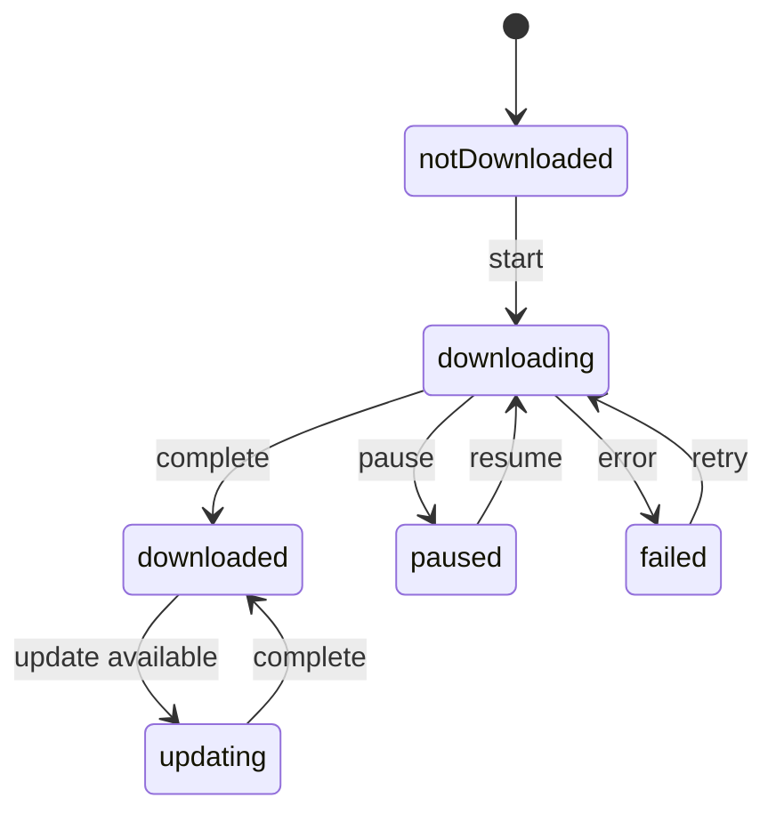

# Project Glossary

## Overview

This document manages the definitions of terms used within the OpenPlanetarium project.
Code, documentation, and UI copy must follow the notation and definitions in this glossary (ubiquitous language).

**Last updated**: 2026-06-11

## Domain Terms (Astronomy)

### Right Ascension / Declination (赤経・赤緯)

**Definition**: The longitude and latitude of the equatorial coordinate system, expressing positions on the celestial sphere. Right ascension (RA) spans 0–360° (0–24h in hour-angle notation); declination (Dec) spans -90° to +90°

**Notes**: All star and object catalogs in this project are stored as J2000-epoch RA/Dec. In code, values are unified in degrees and named `raDeg` / `decDeg`

**Related terms**: [J2000](#j2000), [Horizontal Coordinates](#horizontal-coordinates-地平座標)

### J2000

**Definition**: The standard epoch referenced to January 1, 2000, 12:00 (TT). The reference point in time for star catalog coordinates

**Use in this project**: Catalog coordinates are stored in J2000; at display time, AstroEngine applies precession correction and date/time conversion

### Horizontal Coordinates (地平座標)

**Definition**: The position of a celestial object as seen from the observing location. Expressed as altitude (Alt: 0–90° upward from the horizon) and azimuth (Az: 0–360° eastward from north = 0°)

**Notes**: Coordinates that depend on the observing location and date/time. AstroEngine performs the conversion from equatorial coordinates via sidereal time

### Sidereal Time (恒星時)

**Definition**: A time system measured by the hour angle of the vernal equinox (LST: Local Sidereal Time). Required for equatorial ⇔ horizontal coordinate conversion

**Implementation**: `lib/domain/astro/astro_engine.dart` (`localSiderealTimeDeg`)

### Apparent Magnitude (視等級)

**Definition**: A measure of an object's brightness as seen from Earth. Smaller values are brighter (Vega ≈ 0, naked-eye limit ≈ 6.5). A difference of 1 magnitude is a brightness ratio of about 2.512 (Pogson ratio)

**Use in this project**: Determines star rendering size and glow intensity (F5), and data filtering via LOD and [limiting magnitude](#limiting-magnitude-限界等級) (F2). `magnitude` in code

### Limiting Magnitude (限界等級)

**Definition**: The faintest magnitude targeted for display (or observation). Objects fainter than this are neither loaded nor rendered

**Notes**: The effective value is the minimum of the zoom-level (LOD) cap and the user setting ("show down to magnitude N"). `limitingMagnitude` in code

### B-V Color Index (B-V色指数)

**Definition**: The magnitude difference between the B (blue) and V (visual) bands. An indicator of a star's color (surface temperature). Smaller values mean bluer and hotter; larger values mean redder and cooler (Sirius ≈ 0.0, Betelgeuse ≈ +1.85)

**Use in this project**: The primary input for star color rendering (functional design A3). Converted to effective temperature with the Ballesteros approximation and mapped to blackbody-radiation RGB

### Spectral Type (スペクトル型)

**Definition**: The spectroscopic classification of stars (O / B / A / F / G / K / M, hot → cool)

**Use in this project**: Fallback input for the color of stars that lack a B-V color index

### Proper Motion / Annual Parallax (固有運動・年周視差)

**Definition**: Proper motion is a star's apparent movement across the celestial sphere [mas/yr]. Annual parallax is the apparent positional shift caused by Earth's orbit [mas], corresponding to the reciprocal of distance

**Use in this project**: Retained in the catalog (Star entity). In the MVP, not applied to displayed positions; used for distance display (parallax → light-year conversion)

### Light Pollution Level (光害レベル)

**Definition**: The degree of night-sky brightness caused by artificial light. In this app, expressed directly via the "show down to magnitude N" slider
(display limiting magnitude 1.0–20.0, default 6.5) (lowering the value = appearance under stronger light pollution)

**Use in this project**: The user-side cap on the effective limiting magnitude (functional design A2/A4)

### Nebula Catalogs: Sh2 / LBN / LDN / vdB (星雲カタログ)

**Definition**: Sh2 = Sharpless (HII regions, 313 entries), LBN = Lynds Bright Nebula (emission nebulae, 1,125 entries),
LDN = Lynds Dark Nebula (dark nebulae, about 1,800 entries), vdB = van den Bergh (reflection nebulae, 158 entries)

**Use in this project**: Converted from VizieR (VII/20, VII/9, VII/7A, VII/21) and bundled as assets.
Toggled per catalog on the DSO tab of object settings (default OFF)

### Minor Bodies: Asteroids / Comets (小天体)

**Definition**: Solar system bodies other than the planets. This app includes 129 bright asteroids
(H<8, a<6au) sourced from the JPL Small-Body Database and 120 periodic comets with current orbital elements

**Use in this project**: Positions at observation time are computed via two-body propagation of Keplerian orbits, with
display controlled by magnitude (asteroids down to mag 12, comets down to mag 13). Toggled on the Solar System tab of object settings

### Milky Way (天の川)

**Definition**: The region where the stars of our galaxy appear as a band. Rendered as a textured background layer in this app

### Deep Sky Object (DSO) (深宇宙天体)

**Definition**: Collective term for non-stellar objects outside the solar system: nebulae, galaxies, star clusters, etc.

**Notes**: `DeepSkyObject` in code. Distinct from the Moon, the Sun, and planets (`SolarSystemBody`)

### Messier Objects / NGC / IC (メシエ天体)

**Definition**:
- Messier objects: the 110 objects in the Messier catalog (M1–M110). Bright and easy to observe
- NGC / IC: objects of the New General Catalogue / Index Catalogue. Thousands to over 10,000 in scale

**Use in this project**: Search keys (`M31` / `NGC 224` format) and display targets (F7, F8)

### Moon Age (月齢)

**Definition**: The number of days elapsed since the new moon (0 to about 29.5). Represents the phase of the Moon

**Use in this project**: Rendering the Moon (its phase) and observation support display (F7, F10). Calculated by EphemerisEngine

### Rise/Set Times / Transit (出没時刻・南中)

**Definition**: The times at which an object rises above / sets below the horizon, and the time it crosses due south (the meridian) and reaches its highest point (culmination)

**Use in this project**: Observable-time display on the object detail screen (F9, F10)

### Angular Size (視直径)

**Definition**: An object's apparent size expressed as an angle (e.g., M31 ≈ 3.0°×1.0°)

**Use in this project**: The "fit check" against FOV frames (F12). `angularSizeMajorDeg` / `angularSizeMinorDeg` in code

## Domain Terms (Equipment / Optics)

### Focal Length / Effective Focal Length (焦点距離・合成焦点距離)

**Definition**: Focal length is the distance at which an optical system forms an image [mm]. Effective focal length is the actual value after applying a Barlow/reducer

**Formula**: `effective focal length = telescope focal length × magnification factor`

**Implementation**: `lib/domain/optics/fov_calculator.dart`

### F-ratio (F値)

**Definition**: Focal length ÷ aperture. Smaller values mean a faster (brighter) optical system (the RASA 8 is f/2)

### Barlow Lens / Reducer (バーローレンズ / レデューサー)

**Definition**:
- Barlow: a magnifying lens that extends the effective focal length (1.5x–3x). Narrows the field of view; suited to planets
- Reducer: a reducing lens that shortens the effective focal length (0.5x–0.8x). Widens the field of view; suited to nebulae and galaxies

**Notes**: In code, both are handled uniformly as `OpticalModifier` (kind: barlow / reducer)

### Field of View (FOV) / True FOV / Apparent FOV (視野・実視野・見かけ視野)

**Definition**:
- FOV (Field of View): the extent of sky visible through an optical system / sensor [degrees]
- Apparent FOV (AFOV): the field of view of an eyepiece alone (e.g., 50°)
- True FOV (TFOV): the extent of sky actually visible through a telescope + eyepiece. `True FOV = Apparent FOV ÷ magnification`

**Use in this project**: Camera FOV is overlaid on the sky chart as a rectangular frame; eyepiece true FOV as a circular frame (F12). The visible extent of the sky chart canvas (`ViewportState.fovDeg`) is also called FOV — distinguished by context

### Magnification (倍率)

**Definition**: `magnification = effective focal length ÷ eyepiece focal length`

### Exit Pupil (出口瞳径)

**Definition**: The diameter of the light beam exiting the eyepiece [mm]. `exit pupil = aperture ÷ magnification`. Beyond 7mm (the dark-adapted pupil diameter), light is wasted

### Pixel Scale (ピクセルスケール)

**Definition**: The angle of sky captured by one camera pixel [arcsec/px]. `pixel scale = 206.265 × pixel size [μm] ÷ effective focal length [mm]`

### Equipment Set (機材セット)

**Definition**: A frequently used combination of telescope + camera (or eyepiece) + Barlow/reducer, etc., saved under a name

**Notes**: `EquipmentSet` in code. Camera FOV mode and eyepiece FOV mode are mutually exclusive

### Mosaic Imaging (モザイク撮影)

**Definition**: A technique of imaging a large object that does not fit in one frame by splitting it into multiple panels, with overlap between panels

**Use in this project**: The mosaic plan feature (F12). Computes each panel's center coordinates from rows × columns and the overlap ratio

## Domain Terms (Data / Catalogs)

### Bright Star Catalogue (BSC)

**Definition**: A star catalog of about 9,100 stars brighter than magnitude 6.5. This app's default (Level 1) catalog

**Use in this project**: Automatically downloaded at first launch (F3). `sourceCatalog = 'bsc'`

### Tycho-2

**Definition**: A star catalog of about 2.5 million stars based on Hipparcos satellite observations. Includes positions, proper motions, and two-color photometry. The standard extended (Level 2) catalog

**Use in this project**: Available as an additional download from settings (P1). Partially fetched via magnitude ranges and tile splitting

### Gaia DR3

**Definition**: Data Release 3 of the Gaia satellite. A high-precision astrometric and photometric catalog of over 1.8 billion objects. High-precision extension (Level 3)

**Use in this project**: Post-MVP. Planned together with switching the spatial index to HEALPix

### Survey (サーベイ)

**Definition**: An observation project that systematically images the entire sky (or a wide area), and its image data (DSS, 2MASS, WISE, etc.)

**Use in this project**: Overlaid on the sky chart background as HiPS-format tiles (F11). `SurveyLayer` in code

### HiPS

**Full name**: Hierarchical Progressive Surveys

**Definition**: A HEALPix-based hierarchical tiled astronomical image distribution standard (IVOA recommendation). Images split into tiles per zoom level (order) can be fetched on demand

**Use in this project**: The retrieval format for survey layers. `hips_client.dart` builds tile URLs from order / npix

### HEALPix

**Full name**: Hierarchical Equal Area isoLatitude Pixelization

**Definition**: A scheme that hierarchically divides the celestial sphere into equal-area diamond-shaped pixels. The basis of HiPS tile numbers (npix)

**Use in this project**: Used for HiPS tile calculation (`lib/domain/spatial/healpix.dart`). The star catalog's spatial index in the MVP is a custom RA/Dec grid and is separate from HEALPix (future unification under consideration)

### Spatial Index (空間インデックス)

**Definition**: A mechanism for quickly finding "objects in this region" via tiles that partition the celestial sphere

**Application in this project**: A custom grid of 15° declination bands × RA divisions (about 220 tiles for the whole sky, functional design A1). Stars and DSOs carry their tile membership in a `tileIndex` column

### Tile (タイル)

**Definition**: The unit of spatial partitioning. There are two kinds in this project:
1. **Catalog tile**: the star/object data for one cell of the spatial index (distribution unit: `tiles/<tileIndex>.bin`)
2. **Survey tile**: one HiPS image (identified by order / npix)

**Related terms**: [Spatial Index](#spatial-index-空間インデックス), [HiPS](#hips)

### Viewport (ビューポート)

**Definition**: The set of the celestial region currently shown on the sky chart canvas and its display conditions (center coordinates, field of view, date/time, observing location, active layers)

**Notes**: `ViewportState` in code. A generation ID (viewportId) is advanced on every change and used to decide whether to discard stale query results

### LOD

**Full name**: Level of Detail

**Meaning**: A technique that switches the level of detail of loaded/rendered data according to zoom level

**Use in this project**: The mapping of field of view → limiting magnitude / target catalogs (functional design A2). `lod_policy.dart`

### Prefetch (プリフェッチ)

**Definition**: Reading ahead, in addition to currently needed data, the neighboring tiles and tiles in the direction of movement that will be needed soon

### LRU Cache (LRUキャッシュ)

**Full name**: Least Recently Used Cache

**Meaning**: A caching scheme that evicts the longest-unused entries first when capacity is exceeded

**Use in this project**: Management of survey tiles (memory/disk) and loaded catalog tiles. `tile_cache_manager.dart`

## Technical Terms

### Flutter

**Definition**: Google's cross-platform UI framework

**Official site**: https://flutter.dev

**Use in this project**: The app itself (deployed to 5 platforms). Version 3.x stable (pinned with fvm)

### Dart

**Definition**: Flutter's implementation language. Has sound null safety and concurrency via Isolates

**Use in this project**: All app code. Version 3.x

### Riverpod

**Definition**: A compile-time-safe state management / DI library for Flutter

**Official site**: https://riverpod.dev

**Use in this project**: State management via Controllers (Notifier), dependency injection between layers (flutter_riverpod ^2.x)

### drift

**Definition**: A type-safe SQLite ORM / query builder for Dart

**Official site**: https://drift.simonbinder.eu

**Use in this project**: Catalog DB (catalogs.db) and equipment DB (equipment.db). Runs in the background via DriftIsolate

### dio

**Definition**: An HTTP client for Dart. Supports progress notifications, cancellation, and interceptors

**Use in this project**: Downloading catalogs and HiPS tiles (progress display, retry, resume)

### CustomPainter

**Definition**: Flutter's direct Canvas drawing API

**Use in this project**: All rendering of the sky canvas (SkyPainter). The core of the rendering convention of not turning stars into Widgets

### Isolate

**Definition**: Dart's unit of concurrent execution (no shared memory, message passing)

**Use in this project**: Background execution of DB queries, tile decoding, and catalog imports (protecting the UI thread)

### Impeller

**Definition**: Flutter's next-generation rendering engine

**Use in this project**: A prerequisite for high-frame-rate rendering. On unsupported environments (some Linux), fall back to Skia + performance class adjustment

## Abbreviations / Acronyms

| Abbreviation | Full name | Meaning / use in this project |
|------|---------|------------------------------|
| RA / Dec | Right Ascension / Declination | Right ascension / declination. `raDeg` / `decDeg` in code |
| Alt / Az | Altitude / Azimuth | Altitude / azimuth |
| FOV | Field of View | Field of view (angle). `fovDeg` |
| AFOV / TFOV | Apparent / True FOV | Apparent field of view / true field of view |
| LOD | Level of Detail | Per-zoom detail control |
| LRU | Least Recently Used | Cache eviction scheme |
| BSC | Bright Star Catalogue | Default star catalog |
| DSO | Deep Sky Object | Deep sky object |
| DSS | Digitized Sky Survey | Initially supported survey. Ships with 4 layers: Colored / Blue / Red / NIR |
| HiPS | Hierarchical Progressive Surveys | Survey tile distribution standard |
| npix | pixel number | HEALPix/HiPS tile number |
| mas | milliarcsecond | Milliarcsecond (unit for proper motion / parallax) |
| arcsec | arcsecond | Arcsecond (unit for pixel scale) |
| PRD | Product Requirements Document | `docs/product-requirements.md` |
| MVP | Minimum Viable Product | Minimum viable product (the P0 feature set) |
| KPI | Key Performance Indicator | Success metric |

## Architecture Terms

### 4-Layer Architecture (4層レイヤードアーキテクチャ)

**Definition**: A 4-layer structure of presentation / application / domain / data

**Application in this project**: Dependency direction is presentation → application → domain ← data. The data layer implements the domain layer's interfaces (dependency inversion). Details in `docs/architecture.md`

### Dependency Inversion (依存性逆転)

**Definition**: The principle that higher-level modules depend on abstractions (interfaces) rather than lower-level implementations

**Application in this project**: Repository interfaces live in `lib/domain/repositories/`, implementations in `lib/data/repositories/`. Wiring is done via Riverpod providers

### viewportId (Generation ID) (世代ID)

**Definition**: An ID incremented on every viewport change. Identifies which display state an asynchronous query result belongs to

**Application in this project**: When a result arrives, it is compared against the current viewportId and discarded on mismatch (the implementation of F2's acceptance criterion "never display stale query results")

### Graceful Degradation (グレースフルデグラデーション)

**Definition**: A design policy of continuing to operate within available capabilities even when some features or data are unavailable

**Application in this project**: "Protect the sky display at all costs" — on download failure or cache loss, display continues with already loaded data

### Performance Class (性能クラス)

**Definition**: A device classification (low / mid / high) determined by a simple benchmark at first launch

**Application in this project**: Automatic adjustment of the displayed-star cap, glow quality, and cache limits

### Glassmorphism (グラスモーフィズム)

**Definition**: A frosted-glass-style UI design using translucency + background blur

**Application in this project**: The base style of UI panels (`glass_panel.dart`). The implementation means of the "UI never blocks the sky" policy

## Statuses / States

### Catalog Download States

| Status | Meaning | Transition condition | Next state |
|----------|------|---------|---------|
| notDownloaded | Not fetched | Download started | downloading |
| downloading | Fetching (with progress) | All tiles complete / paused / failed | downloaded / paused / failed |
| paused | Paused (resumable) | Resume action / connection restored | downloading |
| failed | Failed (retryable) | Retry | downloading |
| downloaded | Fetch complete (usable offline) | Update detected | updating |
| updating | Updating (display continues with old data) | Complete | downloaded |

**State transition diagram**:

### FOV Frame Fit Check (FitResult)

| Value | Meaning |
|----|------|
| fits | The object fits within 90% of the frame on both axes |
| tight | 90–100% (just barely fits) |
| overflow | Overflows (suggest mosaic imaging) |

## Data Model Terms

The data model definitions in `docs/functional-design.md` are authoritative for the main entities.

| Entity | Summary |
|------|------|
| `Star` | A star. Queried via a composite index of tile number + magnitude |
| `DeepSkyObject` | Deep sky object (nebulae, galaxies, clusters, Messier/NGC/IC) |
| `SolarSystemBody` | Sun, Moon, planets. Positions are not stored; computed on demand |
| `ConstellationData` | Constellation (lines, boundaries, names, art) |
| `SurveyLayer` | Definition and display settings of a HiPS survey |
| `Telescope` / `CameraDevice` / `Eyepiece` / `OpticalModifier` | Equipment profiles |
| `EquipmentSet` | Equipment combination (referenced by ID; holds no object references) |
| `ViewportState` | Display state (runtime model, not persisted) |

## Errors / Exceptions

| Class name | Trigger condition | Handling |
|------|---------|------|
| `AppException` (base) | - | Sealed class. Carries a UI display message |
| `DownloadException` | Network / server errors | Automatic/manual retry depending on the retryable flag |
| `ValidationException` | Validation failure of equipment input, etc. | Per-field error display, save blocked |
| `CatalogCorruptedException` | Tile checksum mismatch / corruption | Discard the affected tile → re-fetch. Display continues |
| `LocationUnavailableException` | Permission denied / GPS timeout | Fall back to manual location setting |

Detailed handling is authoritative in the error-handling table of `docs/functional-design.md`.

## Calculations / Algorithms

| Name | Summary | Implementation |
|------|------|---------|
| Coordinate conversion (equatorial ⇔ horizontal) | Conversion via sidereal time + stereographic projection | `lib/domain/astro/astro_engine.dart` |
| Ephemeris calculation | Sun/Moon/planet positions, moon age, rise/set times | `lib/domain/astro/ephemeris_engine.dart` |
| Ballesteros approximation | B-V color index → effective temperature → RGB | `lib/domain/appearance/star_appearance.dart` |
| Pogson-formula-based size calculation | Apparent magnitude → rendering size, glow, opacity | Same as above |
| RA/Dec grid | Coordinates → tile number, viewport intersection test | `lib/domain/spatial/spatial_index.dart` |
| FOV calculation | FOV, magnification, pixel scale, exit pupil, mosaic | `lib/domain/optics/fov_calculator.dart` |
| HiPS order selection | Field of view → tile resolution (order) decision | `lib/data/survey/hips_client.dart` |

The algorithm designs (A1–A6) in `docs/functional-design.md` are authoritative for the calculation formulas.
