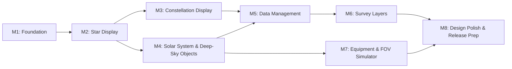

# Implementation Plan

This document is an implementation plan that divides the MVP (the P0/P1 features in `docs/product-requirements.md`) into milestones.
For design details of each milestone, refer to `docs/functional-design.md` (F-numbers and A-numbers).

**Last updated**: 2026-06-11

## Overall Roadmap

- M3 and M4, and M6 and M7, have weak dependencies and can be worked on in parallel
- At the start of each milestone, create `.steering/[YYYYMMDD]-[task-name]/` and break tasks down further (per the CLAUDE.md flow)

## Milestone 1: Foundation

**Goal**: Build the architectural skeleton and the base of the sky canvas, reaching a state where "the sky at the current location and current date/time (no stars yet) is rendered and can be panned and zoomed"

**Requirements covered**: F1 (partial), F2 (skeleton), F13

### Scope

- Create the Flutter project (verify builds on all 5 platforms)
- 4-layer directory structure (`docs/repository-structure.md`) and Riverpod wiring scaffold
- Basic domain-layer models (`SkyPoint` / `GeoLocation` / `ViewportState`)
- AstroEngine: sidereal time, equatorial ⇔ horizontal coordinate transformation, stereographic projection and inverse projection (prerequisite for A1)
- SkyPainter skeleton: render background gradient + horizon + cardinal directions only
- ViewportController: pan/zoom operations (mobile: pinch/swipe, desktop: wheel/drag) and viewportId generation management
- TimeController / LocationController: date/time setting, GPS acquisition, manual location fallback
- Responsive layout skeleton (desktop: persistent panel / mobile: full screen + control bar)
- CI setup (format / analyze / test / Windows, Linux, and Android builds)

### Completion Criteria

- [ ] Builds and launches on all 5 platforms
- [ ] Horizon and cardinal directions are displayed based on current location and current date/time
- [ ] Pan/zoom runs at 60fps (with few render targets)
- [ ] AstroEngine unit tests match known ephemeris values (`test/fixtures/` prepared)
- [ ] CI runs automatically on every PR

### Key Risks

- **Coordinate transformation accuracy bugs propagate to all features** → Complete fixture verification in this milestone, then guard with regression tests afterwards

## Milestone 2: Star Display

**Goal**: Load BSC-equivalent star data based on the viewport and render beautiful stars according to magnitude and color

**Requirements covered**: F1, F2, F5 (algorithms: A1, A2, A3, A4)

### Scope

- SpatialIndex (RA/Dec grid): coordinate→tile mapping, viewport intersection testing, prefetch target computation
- CatalogRepository interface and asset implementation (Note — implementation-time decision: since BSC-class 9,000 stars are light enough to keep fully in memory, introducing the drift schema was moved to M5, alongside Tycho-2 partial download)
- BSC data ingestion: convert source data (HYG v4.1) → tile binaries with `tool/catalog_converter/`; for development, ship bundled as assets first (auto download in M5)
- ViewportController tile query mediation: debounce, Isolate queries, viewportId matching, LOD (A2)
- StarAppearance: B-V→RGB (A3), magnitude→size/glow/opacity (A4)
- StarRenderer: batch rendering via drawAtlas/drawRawPoints, glow sprites
- Celestial object selection via tap/click (inverse projection + nearest-neighbor search)
- Basic implementation of light pollution level setting

### Completion Criteria

- [ ] All ~9,000 stars down to magnitude 6 are displayed at correct positions, colors, and sizes
- [ ] Pan/zoom at 55fps or higher on a mid-range mobile device (F2 acceptance criterion)
- [ ] Tests confirm that stars outside the viewport are neither queried nor rendered
- [ ] Stale query results are not displayed during fast panning
- [ ] Color verification tests pass: Sirius = bluish white / Betelgeuse = reddish

### Key Risks

- **Failure to meet performance targets** → Add performance tests (traceAction) to CI at M2 completion as an early warning. If unmet, prioritize strengthening performance class control and rendering simplification

## Milestone 3: Constellation Display

**Goal**: Beautifully display lines, names, and boundaries of all 88 constellations, with ON/OFF and language switching

**Requirements covered**: F6

### Scope

- Create ConstellationData assets (constellation lines, boundaries, names in 3 languages) and a validation script (`tool/`)
- ConstellationRenderer: lines, boundaries, name labels (reusing SpatialIndex for viewport intersection testing)
- Display settings (lines/names/boundaries ON/OFF, opacity, thickness, language) and SettingsController
- Label overlap avoidance (grid hash)
- Basic implementation of constellation art (P1: establish the display pipeline with a few representative constellations such as Orion)

### Completion Criteria

- [ ] Lines and names of all 88 constellations are displayed and can be toggled ON/OFF individually
- [ ] Name language (Japanese/English/Latin) can be switched
- [ ] Frame rate requirements are maintained even with constellation lines displayed

## Milestone 4: Solar System & Deep-Sky Objects

**Goal**: Display the Sun, Moon, planets, and Messier/major NGC objects, completing the search → centering → detail-view flow

**Requirements covered**: F7, F8, F9, F10

### Scope

- EphemerisEngine: position calculation for the Sun, Moon, and planets (e.g., truncated VSOP87), lunar phase, rise/set and transit times
- SolarSystemRenderer: texture rendering (lunar phases, Saturn's rings, Jupiter's bands)
- Create DSO assets (Messier 110 + major NGC/IC, thumbnails and descriptions) and DsoRenderer
- SearchService: query interpretation (name/constellation/M/NGC/IC), Japanese-English fuzzy search, result centering
- Celestial object detail UI (desktop: side panel / mobile: bottom sheet)
- Time slider, diurnal motion animation, "return to current time" (F10)
- Search UI (list of currently visible objects and recommendations are P1)

### Completion Criteria

- [ ] The Sun, Moon, and 7 planets are displayed at correct positions (verified with ephemeris fixtures)
- [ ] Lunar phases are displayed according to the Moon's age
- [ ] Searches for M31 / NGC 891 / Sirius / Orion / Saturn hit and center the result (KPI: test set prepared for 95% search hit rate)
- [ ] Object details show rise/set and transit times
- [ ] The sky follows the time slider smoothly

## Milestone 5: Data Management (Download & Offline)

**Goal**: Complete automatic catalog download, settings, and offline caching, achieving the KPIs "first launch within 5 minutes" and "100% offline operation"

**Requirements covered**: F3, F4

### Scope

- Finalize the catalog distribution format (manifest.json + tile binaries + SHA-256) and the distribution environment (static HTTPS hosting)
- DownloadService: progress stream, per-tile resume, exponential backoff retry, Wi-Fi detection
- First-launch onboarding (progress display, retry UI on failure)
- Data download settings screen (catalog/magnitude/region/method/capacity display/cache deletion/update check)
- Tycho-2 support (P1): partial download of per-magnitude-range tiles, integration with LOD A2
- Switch bundled asset data (the M2 interim approach) to the download method; decide whether to bundle a minimal subset of constellation-line reference stars

### Completion Criteria

- [x] With default catalogs bundled, the sky is displayed immediately from first launch (the 5-minute KPI is always met. Note: spec changed during implementation from download to bundled approach; see PRD F3)
- [x] Sky, constellations, and detail views work 100% in airplane mode (KPI)
- [x] Download interrupt → resume and corrupted-tile re-fetch work (integration tests)
- [x] Catalog deletion, re-download, and download-method settings work

### Key Risks

- **Distribution server operation model undecided** → The implementation is configurable via CATALOG_BASE_URL (--dart-define); distribution of actual Tycho-2 data will be added after the server is finalized (can be handled by catalog registration alone)

## Milestone 6: Survey Layers (HiPS)

**Goal**: Overlay survey imagery such as DSS on the sky chart, enabling tile caching and opacity adjustment

**Requirements covered**: F11 (algorithm: A6)

### Scope

- HEALPix npix computation (`domain/spatial/healpix.dart`) and HiPS client (order selection, URL construction)
- TileCacheManager: memory + disk LRU, per-survey capacity limits, 3-level fallback
- SurveyRenderer: tile rendering, gap filling with lower orders, opacity
- Built-in definitions for the 4 initially shipped layers: DSS Colored / DSS Blue / DSS Red / DSS NIR (CDS HiPS; see the survey table in the functional design document)
- Survey settings screen (list, ON/OFF, opacity, cache limit, attribution display) and exclusive layer switching
- Adding surveys beyond DSS (P1: confirm that adding 2MASS / WISE etc. can be done just by adding SurveyLayer records)

### Completion Criteria

- [ ] The 4 layers DSS Colored / Blue / Red / NIR overlay the sky chart at resolutions matching the zoom level and can be switched
- [ ] Only tiles for the visible area plus surroundings are fetched (verified via network logs)
- [ ] When offline, only cached tiles are displayed and a badge is shown
- [ ] Cache capacity limits are enforced (LRU test)
- [ ] Opacity changes are applied without re-downloading

## Milestone 7: Equipment Profiles & FOV Simulator

**Goal**: Complete imaging-planning support from equipment registration to FOV frame display and mosaic planning

**Requirements covered**: F12 (algorithm: A5)

### Scope

- FovCalculator (pure domain computation): effective focal length, FOV, pixel scale, magnification, true field of view, exit pupil diameter, fit determination, mosaic coordinates
- equipment.db schema and EquipmentRepository (CRUD)
- Equipment management UI (register/edit/delete telescopes/cameras/eyepieces/Barlows/reducers, validation)
- Saving, switching, and display-color settings for equipment sets
- FovFrameRenderer: rectangular/circular frames, rotation handle, drag movement, object centering
- Fit determination display (fits / tight / overflow) and mosaic plan (rows/columns, overlap rate, panel center coordinates, serpentine order)
- Multi-frame comparison (P1)

### Completion Criteria

- [ ] Calculation examples from the PRD (RASA 8 + ASI294MC Pro, etc.) within 1% error (KPI, unit tests)
- [ ] Camera FOV displayed as a rectangle and eyepiece FOV as a circle on the sky chart
- [ ] Barlows/reducers are correctly reflected in the FOV
- [ ] When M31 is selected, the suggestion "does not fit → mosaic recommended" is displayed
- [ ] Equipment sets persist across app restarts

## Milestone 8: Design Polish & Release Prep

**Goal**: Raise visual quality to the KPI level ("beautiful" compared to competitors) and prepare releases for the 5 platforms

**Requirements covered**: F1 (finishing touches such as Milky Way and twinkling), F13, all non-functional requirements

### Scope

- Sky rendering quality improvements: Milky Way texture, star twinkling, night sky gradient tuning, glow quality (consider introducing fragment shaders if needed)
- UI visual unification: glass panels, object selection animation, transitions
- Usability improvements: keyboard shortcut list (desktop), gesture tuning (mobile)
- Performance tuning: final per-performance-class adjustments, memory limit verification
- Acceptance testing: measure all PRD KPIs (first launch 5 min / offline 100% / 55fps / search 95% / FOV error 1% / 5-minute learnability)
- Usability testing (new users complete the basic flow within 5 minutes) and screenshot comparison review
- Packaging for each store/distribution channel (code signing, icons, store assets)

### Completion Criteria (status as of 2026-06-11)

- [x] KPI verification (within what is verifiable in the development environment):
  - First launch to sky display: immediate thanks to bundled catalogs (no network needed) ✅
  - Offline operation: stars, constellations, objects, search, and details work 100% with bundled data ✅
  - FOV calculation within 1% error: verified by unit tests ✅
  - Search hits: acceptance set (M31/NGC891/Sirius/Orion/Saturn/Pleiades) tested ✅
  - Mobile 55fps, 5-minute learnability, screenshot comparison: **not measured** (requires mobile devices and test subjects; remaining pre-release task)
- [x] Tests: all 163 unit tests pass + Windows launch smoke test
  - Preparing the 5 E2E (integration_test) scenarios is a **remaining task** (this development machine is Windows-only, so the 5 platforms cannot all be exercised)
- [x] Release build: generated and launch-verified on Windows (--release)
  - macOS/iOS/Linux/Android builds, signing, and store assets are **remaining tasks** (requires each platform's toolchain)

### Remaining Tasks (to do before release)

- Frame rate measurement on physical mobile devices and performance class tuning
- macOS/iOS/Linux/Android build verification and packaging
- 5 E2E scenarios via integration_test
- Whole-sky verification of HiPS tile image orientation (rotation/flip) (currently an interim mapping; TODO in survey_renderer.dart)
- Star twinkling animation (together with a cost evaluation of constant repainting)

## Cross-Milestone Operating Rules

- **Quality gate**: At the end of each milestone, confirm (1) CI green, (2) completion checklist done, (3) diffs reflected in `docs/` (if design changed) before moving on
- **Performance monitoring**: From M2 onward, keep pan/zoom performance tests in CI at all times to detect regressions
- **Documentation updates**: If implementation diverges from the design, record it in the steering design.md and then update the persistent documents (`docs/`)
- **Scope management**: P1 items (Tycho-2 / constellation art / multiple surveys / multi-frame comparison, etc.) are not included in any milestone's completion criteria. Do them within the same milestone if capacity allows; otherwise move them to the backlog

## Post-MVP Backlog (reference)

From the PRD's "Future features": Gaia DR3 support (HEALPix migration), AR mode, telescope mount integration, imaging plans and observation logs, AI commentary, display of comets, asteroids (minor bodies), and artificial satellites, etc. Priorities will be decided based on feedback after the MVP release.
